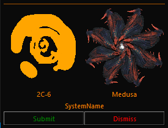

# EDMC-Glyph
EDMC Plugin to capture thargoid glyph data

# Usage

The Glyph scanner will remain dormant until you use the xeno scanner to scan a Thargoid interceptor and get a material entry in your journal. There seems to be an issue where materials are not being dropped consistently, however if you bind your composition scanner and your xeno scanner to the same key, then the composition scanner will also trigger the UI if it detects a Thargoid Interceptor.

Left clicking on the displyed glyph will cycle through the inner markings. The thargoid image next to it will switch to an the known type for the selected inner glyph.

Right clicking on the displayed glyph will cycle through the outer markings. 

One you have matched the Glyph displayed on your hud, you can override the Interceptor type by clicking on its image.

The tool will attempt to identify hostility and set the colour of the inteceptor name to green (friendly) or red (Hostile) you can overide the selection by clicking on the name.

Once you have made your selections you can click the submit button and it will send the following information to a speadheet.

* Commander Name
* System Name
* x,y,z coordinates
* id64 
* The Interceptor Type
* The glyph identification code.

The captured data can be found at [Thargoid Glyph Sheet](https://canonn.fyi/glyphsheet)

## How to install. 
First you must install [Elite Dangerous Market Connector](https://github.com/Marginal/EDMarketConnector/blob/master/README.md)

Load the application and go to the plugins tab of the settings screen. This will show you where you will need to install the EDMC-Glyph plugin. 

Download the Source Code zip file for [the latest release](https://github.com/canonn-science/EDMC-Glyph/releases/latest) and extract the folder into the plugins directory. (this can be found under *Assets* near the bottom of the release page.

Restart EDMC
